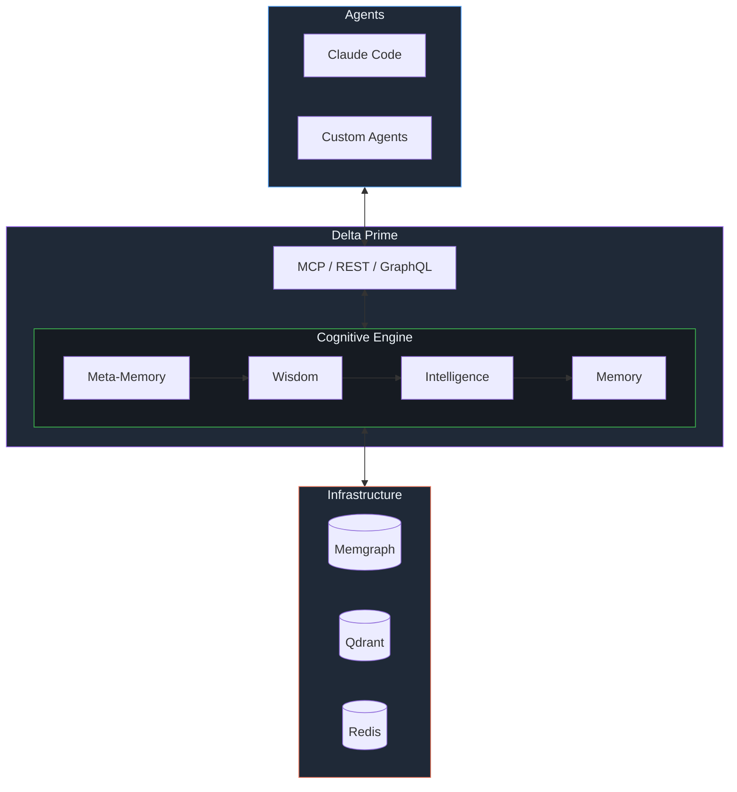

<div align="center">


<br /><br />

**Cognition infrastructure. Context rot's cure.**<br />
Building the cognitive backbone for AI through bi-temporal knowledge graphs.

<br />

[Projects](#projects) &nbsp;&bull;&nbsp; [Architecture](#architecture) &nbsp;&bull;&nbsp; [Quick Start](#quick-start)

</div>

<br />

## Why Delta Prime

- **Memory** &mdash; Graph + vector storage for entities, facts, and events
- **Intelligence** &mdash; Automatic entity extraction and relationship discovery
- **Wisdom** &mdash; GraphRAG clustering surfaces patterns and hierarchical insights
- **Meta-Memory** &mdash; Bi-temporal tracking knows what you knew, and when

<br />

## The Cognitive Stack

<table>
<tr>
<td width="50%">

### Memory
*Raw context persistence*

```mermaid
flowchart LR
    subgraph MEMORY["Memory Layer"]
        direction TB
        E[Entities] --> G[(Graph)]
        F[Facts] --> G
        V[Events] --> G
        G --> S[(Vectors)]
    end
    
    style MEMORY fill:#0d1117,stroke:#58a6ff
```



Storage of atomic context: entities, facts, events, and their embeddings. The foundation everything else builds on.

</td>
<td width="50%">

### Intelligence
*Understanding through structure*

```mermaid
flowchart LR
    subgraph INTEL["Intelligence Layer"]
        direction TB
        X[Extract] --> R[Relate]
        R --> C[Cluster]
        C --> E[Embed]
    end
    
    style INTEL fill:#0d1117,stroke:#a371f7
```



Entity extraction, relationship discovery, semantic clustering. Turning raw text into structured knowledge.

</td>
</tr>
<tr>
<td width="50%">

### Wisdom
*Patterns and insights*

```mermaid
flowchart LR
    subgraph WISDOM["Wisdom Layer"]
        direction TB
        P[Patterns] --> H[Hierarchies]
        H --> I[Insights]
        I --> S[Summaries]
    end
    
    style WISDOM fill:#0d1117,stroke:#3fb950
```



GraphRAG clustering builds hierarchical summaries. Emergent patterns surface from connected context.

</td>
<td width="50%">

### Meta-Memory
*Context about context*

```mermaid
flowchart LR
    subgraph META["Meta-Memory Layer"]
        direction TB
        VT[Valid Time] --> BT{Bi-Temporal}
        ST[System Time] --> BT
        BT --> H[History]
    end
    
    style META fill:#0d1117,stroke:#f78166
```



Bi-temporal tracking: what was true vs. when we learned it. Enables reasoning about knowledge evolution.

</td>
</tr>
</table>

<br />

### System Architecture



<br />

## Projects

| Repository | Description |
|------------|-------------|
| **[contextr](https://github.com/delta-prime/contextr)** | External Graph-RAG memory layer with MCP support |
| **specifications** | Bi-temporal AI context and graph clustering standards |
| **adaptors** | Bridge implementations for REST, MCP, and GraphQL |

<br />

## Quick Start

```bash
# Ingest a codebase into persistent memory
uv run python -m cli ingest ./src --session-id my-project

# Semantic search
uv run python -m cli lookup "authentication flow"
```

**Connect Claude Code via MCP:**

```json
{
  "mcpServers": {
    "contextr": {
      "type": "http",
      "url": "http://localhost:8000/mcp"
    }
  }
}
```

<br />

---

<div align="center">
  <sub>MIT License &bull; Delta Prime Labs &bull; 2026</sub>
</div>
