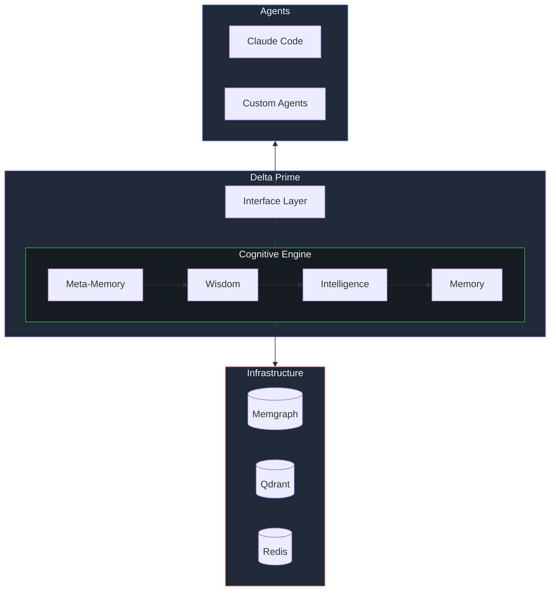

  

**Cognition infrastructure. Context rot's cure.** 
Building the cognitive backbone for AI through bi-temporal knowledge graphs.

 

### *Cognition without continuity is just computation.*

 

[The Problem](#the-problem) &nbsp;&bull;&nbsp; [Philosophy](#philosophy) &nbsp;&bull;&nbsp; [Cognitive Stack](#the-cognitive-stack) &nbsp;&bull;&nbsp; [Projects](#projects)

 

## The Problem

> *"Current systems create a category error: they apply cognitive decay to factual claims, or treat facts and experiences with identical update mechanics."*
> &mdash; [Roynard, 2026](https://arxiv.org/abs/2604.11364)

AI agents forget. Context windows overflow. Facts contradict without reconciliation. This is **context rot** &mdash; the systematic degradation of coherent reasoning as operational history grows.

The root cause: applying uniform persistence to fundamentally different types of knowledge. Gaussian decay is correct for experiences. It's wrong for facts.

 

## Philosophy

We implement the [four-layer cognitive decomposition](https://arxiv.org/abs/2604.11364) that identifies the missing knowledge layer in cognitive architectures:

| Layer | Persistence Semantics | Examples |
|-------|----------------------|----------|
| **Memory** | Ebbinghaus decay &mdash; experiences fade | "User asked about auth on 2026-04-21" |
| **Knowledge** | Indefinite supersession &mdash; facts persist until contradicted | "OAuth tokens expire in 30 days" |
| **Wisdom** | Evidence-gated revision &mdash; beliefs update on evidence, not time | "This team ships on Fridays" |
| **Intelligence** | Ephemeral inference &mdash; per-session working memory | "For this query, I considered A, B, C" |

Different knowledge types require different update mechanics. A fact shouldn't decay like a memory. A pattern shouldn't update like an observation. Contradictions create supersession edges, not silent overwrites.

 

## Why Delta Prime

- **Memory** &mdash; Graph + vector storage for entities, facts, and events
- **Intelligence** &mdash; Automatic entity extraction and relationship discovery
- **Wisdom** &mdash; GraphRAG clustering surfaces patterns and hierarchical insights
- **Meta-Memory** &mdash; Bi-temporal tracking knows what you knew, and when

 

## The Cognitive Stack

<table>
<tr>
<td width="50%">

### Memory
*Raw context persistence*

```mermaid
flowchart LR
    subgraph MEMORY["Memory Layer"]
        direction TB
        E[Entities] --> G[(Graph)]
        F[Facts] --> G
        V[Events] --> G
        G --> S[(Vectors)]
    end
    
    style MEMORY fill:#0d1117,stroke:#58a6ff
```

Storage of atomic context: entities, facts, events, and their embeddings. The foundation everything else builds on.

</td>
<td width="50%">

### Intelligence
*Understanding through structure*

```mermaid
flowchart LR
    subgraph INTEL["Intelligence Layer"]
        direction TB
        X[Extract] --> R[Relate]
        R --> C[Cluster]
        C --> E[Embed]
    end
    
    style INTEL fill:#0d1117,stroke:#a371f7
```

Entity extraction, relationship discovery, semantic clustering. Turning raw text into structured knowledge.

</td>
</tr>
<tr>
<td width="50%">

### Wisdom
*Patterns and insights*

```mermaid
flowchart LR
    subgraph WISDOM["Wisdom Layer"]
        direction TB
        P[Patterns] --> H[Hierarchies]
        H --> I[Insights]
        I --> S[Summaries]
    end
    
    style WISDOM fill:#0d1117,stroke:#3fb950
```

GraphRAG clustering builds hierarchical summaries. Emergent patterns surface from connected context.

</td>
<td width="50%">

### Meta-Memory
*Context about context*

```mermaid
flowchart LR
    subgraph META["Meta-Memory Layer"]
        direction TB
        VT[Valid Time] --> BT{Bi-Temporal}
        ST[System Time] --> BT
        BT --> H[History]
    end
    
    style META fill:#0d1117,stroke:#f78166
```

Bi-temporal tracking: what was true vs. when we learned it. Enables reasoning about knowledge evolution.

</td>
</tr>
</table>

 

### System Architecture

 

## Projects

| Repository | Description |
|------------|-------------|
| **[contextr](https://github.com/delta-prime/contextr)** | The cognitive memory layer for AI agents |
| **specifications** | Bi-temporal context and knowledge graph standards |
| **adaptors** | Integration bridges for agent frameworks |

 

---

  MIT License &bull; Delta Prime Labs &bull; 2026

