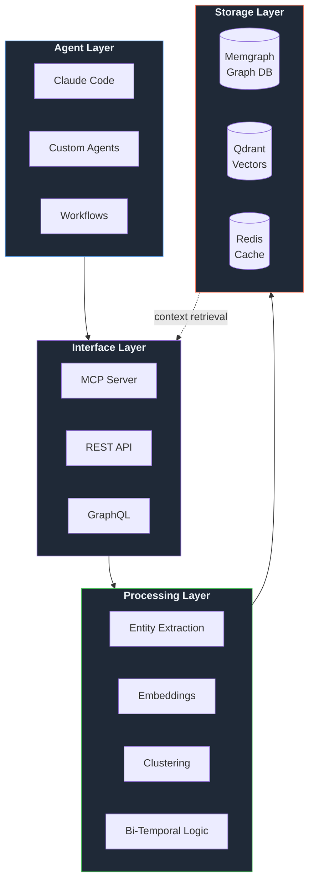

<div align="center">


<br /><br />

**Cognition infrastructure. Context rot's cure.**<br />
Building the cognitive backbone for AI through bi-temporal knowledge graphs.

<br />

[Projects](#projects) &nbsp;&bull;&nbsp; [Architecture](#architecture) &nbsp;&bull;&nbsp; [Quick Start](#quick-start)

</div>

<br />

## Features

- **Graph-RAG Context Storage** &mdash; Memgraph + Qdrant for relational, searchable memory
- **Bi-Temporal Tracking** &mdash; Valid time vs. system time history for context evolution  
- **MCP Integrations** &mdash; Drop-in memory layer for Claude Code and other AI agents
- **GraphRAG Clustering** &mdash; Hierarchical summaries with automatic entity extraction

<br />

## Architecture



<br />

## Projects

| Repository | Description |
|------------|-------------|
| **[contextr](https://github.com/delta-prime/contextr)** | External Graph-RAG memory layer with MCP support |
| **specifications** | Bi-temporal AI context and graph clustering standards |
| **adaptors** | Bridge implementations for REST, MCP, and GraphQL |

<br />

## Quick Start

```bash
# Ingest a codebase into persistent memory
uv run python -m cli ingest ./src --session-id my-project

# Semantic search
uv run python -m cli lookup "authentication flow"
```

**Connect Claude Code via MCP:**

```json
{
  "mcpServers": {
    "contextr": {
      "type": "http",
      "url": "http://localhost:8000/mcp"
    }
  }
}
```

<br />

---

<div align="center">
  <sub>MIT License &bull; Delta Prime Labs &bull; 2026</sub>
</div>
