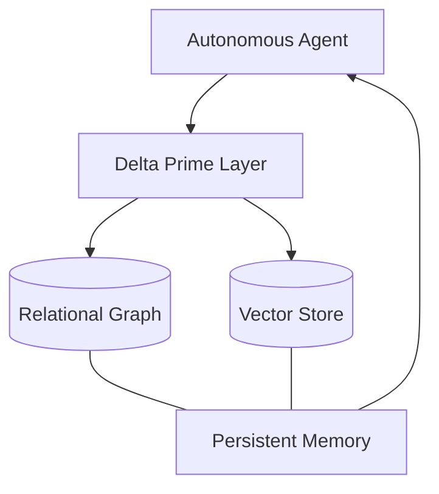

<div align="center">



<br />

# Persistent AI Memory Infrastructure
Delta Prime builds the infrastructure for persistent, high-fidelity context storage. We solve context rot by moving enriched semantic data into external, bi-temporal knowledge graphs.

[Explore Projects](#projects) • [Specifications](#specs) • [Get Started](#start)

---

</div>

<br />

## High-Fidelity Context Management
Traditional context is ephemeral. Delta Prime provides the permanent memory layer needed for autonomous systems to reason across sessions, projects, and environments.

<br />

<table width="100%" border="0" cellspacing="0" cellpadding="20">
  <tr>
    <td width="50%" valign="top">
      <br />
      <h3>Graph-RAG Engine</h3>
      Powered by <strong>contextr</strong>, our core service uses Memgraph and Qdrant to create a relational, searchable memory bank for any LLM.
    </td>
    <td width="50%" valign="top">
      <br />
      <h3>Bi-Temporal Tracking</h3>
      We maintain a separate history for valid time vs. system time, allowing agents to understand how information has evolved over its lifecycle.
    </td>
  </tr>
</table>

<br />

## Core Architecture
We believe context is a living network of entities and events, not a flat list of text chunks.



<br />

## Projects & Standards

| Repository | Purpose |
| :--- | :--- |
| **[contextr](https://github.com/delta-prime/contextr)** | Externalized memory layer with Graph-RAG and MCP support. |
| **specifications** | Drafts for bi-temporal AI context and graph clustering standards. |
| **adaptors** | High-performance bridge implementations for REST, MCP, and GraphQL. |

<br />

## Implementation
Tools are distributed via the `contextr` ecosystem.

```bash
# Sync your project into the persistent memory layer
uv run python -m cli ingest ./src --session-id "primary-sync"
```

---

<div align="center">
  <small>&copy; 2026 Delta Prime Labs</small>
</div>
